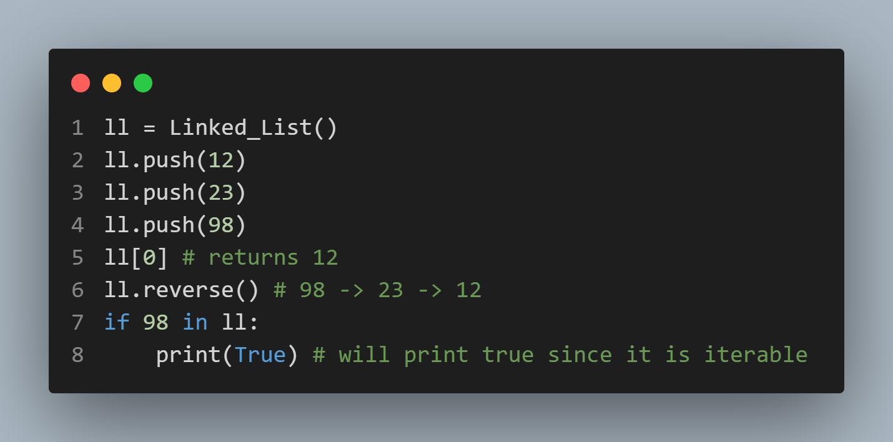
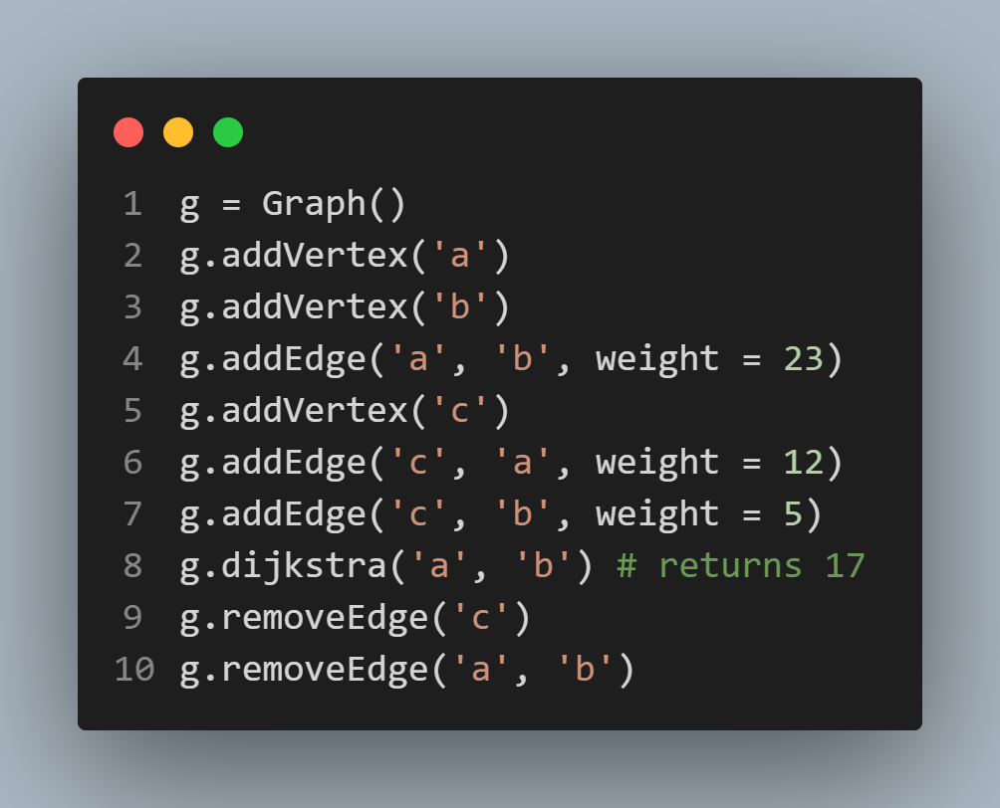

# DSA Python Library

This is a simple and extensible Python library for practicing and implementing fundamental **Data Structures and Algorithms (DSA)**.

Currently, it includes an enhanced **Linked List** implementation with the following features:

## Features

- Custom `Linked_List` class with:
  - `push()` and `pop()` methods
  - Reversal (`reverse()`)
  - Length support via `len()` (`__len__`)
  - Indexing support (`__getitem__`)
  - Iteration support (`__iter__`)
  - String representation (`__str__`)
- Custom `Graph` class with:
  - `addVertex(node_1)`, `addEdge(node_1, node_2, weight)` methods
  - Remove edge between two node `removeEdge(node_1, node_2)`
  - Remove vertices `removeVertex(node_1)`
  - Find the shortest path between node with Dijkstra `dijkstra(node_1, node_2)`

## Example Usage for linked list

```python
from linked_list import Linked_List

ll = Linked_List()
ll.push(10)
ll.push(20)
ll.push(30)

print(len(ll))        # Output: 3
print(ll[1])          # Output: 20
for val in ll:
    print(val)        # Output: 10, 20, 30

ll.reverse()
print(ll)             # Output: 30 -> 20 -> 10
```

## Example usage for graph

```python
from graph import Graph
g = Graph()
g.addVertex('a')
g.addVertex('b')
g.addEdge('a', 'b', weight = 23)
g.addVertex('c')
g.addEdge('c', 'a', weight = 12)
g.addEdge('c', 'b', weight = 5)
g.dijkstra('a', 'b') # returns 17
```

---

## Example images

### Linked List :



---

### Graph :


